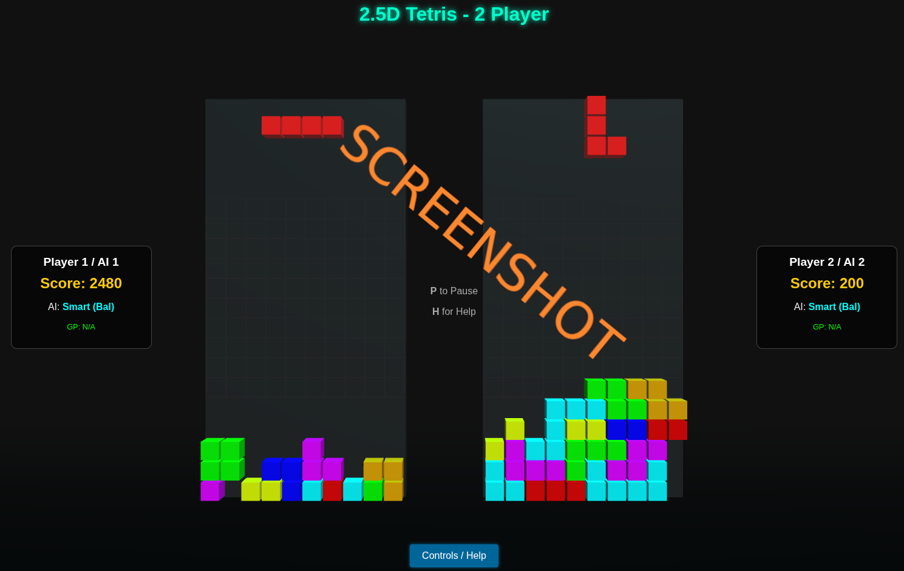
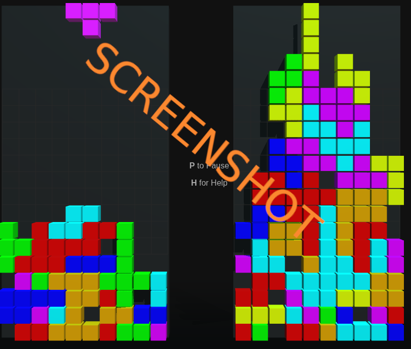

# js_2player_tetris_redux

# 3D JS 2‑Player Tetris (2.5D)

A fully browser‑based **two‑player Tetris variant** built using **Three.js** for 2.5D rendering and vanilla JavaScript for gameplay logic, input handling, gamepad support, and AI control.  
This project reimagines classic competitive Tetris with **side‑by‑side 3D boards**, smooth lighting, shadows, animation, and optional AI opponents for both boards.

## Play it now: https://pemmyz.github.io/js_2player_tetris_redux/

---

## Screenshots



## 🎮 Gameplay Overview

The game features two completely independent Tetris boards rendered in 3D using Three.js.  
Each board supports either:

- A **human player**
- A **gamepad player**
- A **built‑in AI player** (several algorithms available)

Both players drop pieces simultaneously, and the game continues until one or both players top out.

### Key Features

- **2.5D Three.js rendering** with shadows, fog, lights, and animated blocks  
- **100% vanilla JavaScript logic (no frameworks)**  
- **Two fully independent Tetris boards**  
- **Keyboard + Gamepad support (auto‑assignment)**  
- **Multiple AI algorithms**:
  - Center bias
  - Left bias
  - Right bias
  - Random
  - Smart Balanced
  - Smart Offensive
  - Smart Defensive
- **Pause system, help overlay, HUD, scoring, levels**  
- **Smooth real‑time updates via requestAnimationFrame**  
- **2-Player competitive mode or Player vs AI**  

---

## 🧩 Controls

### Player 1 (Keyboard)
| Action | Key |
|-------|-----|
| Move | Arrow Left / Right |
| Rotate | Arrow Up |
| Hard Drop | E |
| Toggle AI | T |

### Player 2 (Keyboard)
| Action | Key |
|-------|-----|
| Move | A / D |
| Rotate | W |
| Hard Drop | R |
| Toggle AI | U |

### Gamepad (Auto‑Assign)
Pressing any gamepad button automatically assigns it to P1 or P2.

| Action | Button |
|--------|---------|
| Move | D‑Pad or Left Stick |
| Rotate | A / Cross |
| Hard Drop | X / Square |

---

## 🎛 Game Systems

### Grid
Each player uses a **20×10 matrix** stored as arrays of integers representing block colors.

### Pieces
The game includes all 7 classic Tetrimino shapes:

- I, O, T, L, J, S, Z  
- Shapes stored as 2D matrices  
- Rotation performed by matrix rotation  
- Color stored as hex value for rendering

### Scoring
Uses classic Tetris scoring:

| Lines Cleared | Points |
|---------------|--------|
| 1 | 40 |
| 2 | 100 |
| 3 | 300 |
| 4 (Tetris) | 1200 |

### Levels
Level increases automatically based on total lines cleared, increasing fall speed.

---

## 🤖 AI Algorithms

### 1. Center Algorithm
Pushes the piece toward the center for a balanced stack.

### 2. Left / Right Bias
Keeps the board heavily stacked on one side.

### 3. Random Move
Chooses random valid landing positions.

### 4. Smart (Balanced)
Attempts to:
- Minimize height
- Minimize holes
- Minimize bumpiness
- Avoid trapping pockets

### 5. Smart (Offensive)
Builds “attack towers” and tries to send the opponent high.

### 6. Smart (Defensive)
Prioritizes low, stable structures to survive as long as possible.

---

## 🎨 Rendering & 3D Engine (Three.js)

### Camera
A single camera frames both boards side-by-side.

### Lighting
- Ambient light for general visibility  
- Directional light with shadows  
- Spotlight for 3D depth  

### Mesh System
Each board uses:

- A **static mesh pool** for locked blocks  
- A **dynamic pool of 4 meshes** for the falling piece  
- A **frame mesh** behind the grid  
- A **floor plane** for reflections and depth  

Meshes update every frame based on grid state.

---

## 🕹 Game Loop

The loop runs via `requestAnimationFrame` and performs:

1. Poll gamepads  
2. Process input  
3. Move/rotate pieces  
4. Apply gravity  
5. Lock pieces & clear lines  
6. Update scores + HUD  
7. Render frame with Three.js  

---

## 📁 Project Structure

```
project/
│
├── index.html     # UI layer, HUD, modals, Three.js container
├── style.css      # Layout, colors, 3D foreground UI
├── script.js      # All game logic + rendering + AI
└── README.md      # This file
```

---

## 🚀 Running the Game

Just open **index.html** in any modern browser:

- Chrome  
- Firefox  
- Edge  
- Steam Deck Browser  
- Android / iOS supported too  

No server required.

---

## 📦 Dependencies

- **Three.js r128+**
- No additional libraries
- 100% self‑contained

---

## 🔧 Development Notes

### Rendering Separation
The project cleanly separates:

- **Game State Logic**  
- **Input Handling**  
- **AI Logic**  
- **Three.js Rendering Layer**

### Input Repetition Control
The game uses time‑based movement throttling (e.g. move interval, fall interval) to avoid fast key repeats.

### Gamepad Detection
Uses:
```js
navigator.getGamepads()
```
and maintains a per-player assignment map.

---

## 🧪 Possible Future Features

- T-spin scoring  
- Garbage sending between boards  
- Configurable piecesets  
- Replay system  
- Online multiplayer  
- Spectator camera

---

## 📜 License

Free for personal or educational use.  
Commercial use allowed with attribution.

---

## 👤 Author

Created by Pekka.  
Built with pure JS and a lot of passion for Tetris and 3D rendering.  
